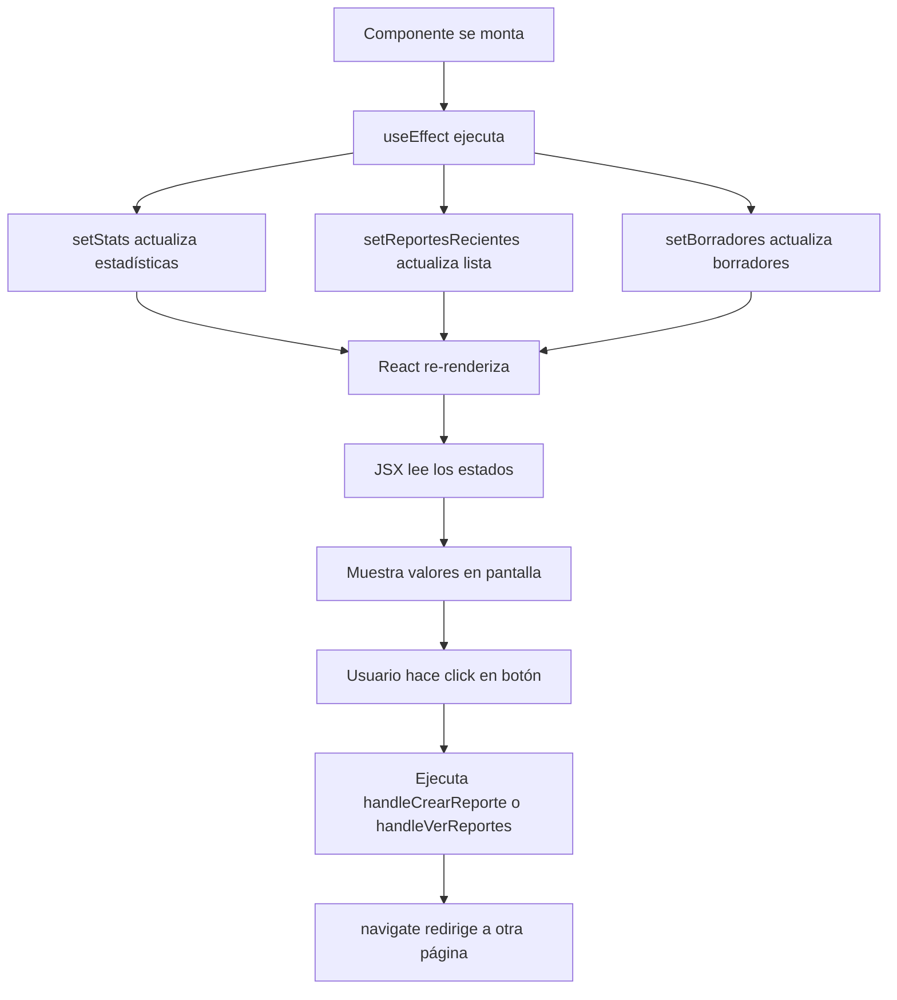

# 📊 Dashboard Component - Documentación

## 📖 Explicación Línea por Línea

### **📦 Importaciones (Líneas 1-5)**

```tsx
import './Dashboard.css';
```
**Línea 1:** Importa los estilos CSS específicos del Dashboard

```tsx
import { useState, useEffect } from 'react';
```
**Línea 2:** 
- `useState`: Hook para manejar estados (datos que cambian en el componente)
- `useEffect`: Hook para ejecutar código cuando el componente se monta

```tsx
import { useNavigate } from 'react-router-dom';
```
**Línea 3:** Hook para navegar entre páginas (redirigir al usuario)

```tsx
import { PiFileArchiveBold, PiCheckCircleBold, PiClockBold, PiPlusBold, PiChartBarBold } from 'react-icons/pi';
```
**Línea 4:** Importa iconos del paquete react-icons
- `PiFileArchiveBold`: Icono de archivo
- `PiCheckCircleBold`: Icono de check (completado)
- `PiClockBold`: Icono de reloj (pendiente)
- `PiChartBarBold`: Icono de gráfico (estadísticas)

```tsx
import Button from '../../components/buttons/Button';
```
**Línea 5:** Importa tu componente Button personalizado

---

### **🔧 Interfaces TypeScript (Líneas 7-19)**

```tsx
interface ReporteReciente {
  id: number;
  cliente: string;
  fecha: string;
  tipo: string;
  estado: string;
}
```
**Líneas 7-13:** Define la estructura de datos para un reporte
- `id`: Número único del reporte
- `cliente`: Nombre del cliente
- `fecha`: Fecha del reporte
- `tipo`: Tipo de servicio (Preventivo, Correctivo, etc.)
- `estado`: Estado actual (Completado, Borrador, Pendiente)

```tsx
interface Borrador {
  id: string;
  cliente: string;
  fechaGuardado: string;
  porcentajeCompletado: number;
}
```
**Líneas 15-20:** Define la estructura para borradores
- `id`: Identificador único del borrador
- `cliente`: Nombre del cliente
- `fechaGuardado`: Fecha y hora en que se guardó
- `porcentajeCompletado`: Porcentaje de completitud (0-100)

---

### **🎯 Componente Principal (Línea 22)**

```tsx
const Dashboard = () => {
```
**Línea 22:** Declara el componente funcional Dashboard usando arrow function

---

### **🔀 Hook de Navegación (Línea 23)**

```tsx
  const navigate = useNavigate();
```
**Línea 23:** Crea la función `navigate` para redirigir a otras páginas

---

### **📊 Estados del Componente (Líneas 25-34)**

```tsx
  const [stats, setStats] = useState({
    totalReportes: 0,
    reportesCompletados: 0,
    reportesPendientes: 0,
    reportesMesActual: 0
  });
```
**Líneas 26-31:** Estado para las estadísticas
- `stats`: Objeto que contiene los números a mostrar en las tarjetas
- `setStats`: Función para actualizar estos valores
- Inicia todo en 0

```tsx
  const [reportesRecientes, setReportesRecientes] = useState<ReporteReciente[]>([]);
```
**Línea 33:** Estado para la lista de reportes recientes (array vacío inicialmente)

```tsx
  const [borradores, setBorradores] = useState<Borrador[]>([]);
```
**Línea 34:** Estado para la lista de borradores (array vacío inicialmente)

---

### **⚡ Hook useEffect (Líneas 36-61)**

```tsx
  useEffect(() => {
```
**Línea 36:** Se ejecuta una vez cuando el componente se carga

```tsx
    setStats({
      totalReportes: 156,
      reportesCompletados: 142,
      reportesPendientes: 8,
      reportesMesActual: 23
    });
```
**Líneas 39-44:** Actualiza las estadísticas con datos simulados

> 💡 **Nota:** Aquí harías `await axios.get('/api/stats')` para obtener datos reales

```tsx
    setReportesRecientes([
      { id: 1, cliente: 'Empresa ABC', fecha: '2025-12-06', tipo: 'Preventivo', estado: 'Completado' },
      { id: 2, cliente: 'Corporación XYZ', fecha: '2025-12-05', tipo: 'Correctivo', estado: 'Borrador' },
      // ... más reportes
    ]);
```
**Líneas 45-51:** Llena el array de reportes recientes con 5 ejemplos

```tsx
    setBorradores([
      { id: 'draft-1', cliente: 'Corporación XYZ', fechaGuardado: '2025-12-05 14:30', porcentajeCompletado: 65 },
      { id: 'draft-2', cliente: 'Grupo GHI', fechaGuardado: '2025-12-03 09:15', porcentajeCompletado: 40 }
    ]);
```
**Líneas 54-57:** Llena el array de borradores con 2 ejemplos

```tsx
  }, []);
```
**Línea 58:** Array vacío `[]` significa "ejecutar solo una vez al montar"

---

### **🎬 Funciones de Eventos (Líneas 60-67)**

```tsx
  const handleCrearReporte = () => {
    navigate('/crear');
  };
```
**Líneas 60-62:** Función que redirige a la página de crear reporte

```tsx
  const handleVerReportes = () => {
    navigate('/reporte');
  };
```
**Líneas 64-66:** Función que redirige a la página de reportes

---

### **🖼️ Renderizado JSX (Líneas 69-220)**

```tsx
  return (
    <div className="dashboard">
```
**Líneas 69-70:** Inicia el return (lo que se muestra en pantalla). Contenedor principal con clase `dashboard`

---

#### **📋 Encabezado (Líneas 71-74)**

```tsx
      <div className="dashboard-header">
        <h1>Dashboard</h1>
        <p className="dashboard-subtitle">Sistema de Gestión de Reportes de Mantenimiento</p>
      </div>
```
**Líneas 71-74:** Título y subtítulo del dashboard

---

#### **📊 Tarjetas de Estadísticas (Líneas 77-120)**

```tsx
      <div className="dashboard-stats">
```
**Línea 77:** Contenedor grid para las 4 tarjetas

```tsx
        <div className="stat-card stat-card--primary">
          <div className="stat-card-icon">
            <PiFileArchiveBold />
          </div>
          <div className="stat-card-content">
            <h3>{stats.totalReportes}</h3>
            <p>Total Reportes</p>
          </div>
        </div>
```
**Líneas 78-86:** Primera tarjeta (Total Reportes)
- `stat-card--primary`: Clase para color azul
- `{stats.totalReportes}`: Muestra el valor del estado (156)

**Estructura de las 4 tarjetas:**
1. **stat-card--primary**: Azul → Total Reportes
2. **stat-card--success**: Verde → Completados
3. **stat-card--warning**: Amarillo → Pendientes
4. **stat-card--info**: Azul claro → Este Mes

---

#### **🚀 Botones de Acceso Rápido (Líneas 123-139)**

```tsx
      <div className="dashboard-actions">
        <h2>Accesos Rápidos</h2>
        <div className="action-buttons">
```
**Líneas 123-125:** Contenedor para botones de acción

```tsx
          <Button
            btnType="button"
            className="primary"
            text="Crear Reporte"
            onClick={handleCrearReporte}
          />
```
**Líneas 126-131:** Botón "Crear Reporte"
- `btnType="button"`: Tipo HTML button
- `className="primary"`: Estilo primario (azul/amarillo)
- `onClick={handleCrearReporte}`: Al hacer click, ejecuta la función que navega a `/crear`

**Líneas 132-137:** Botón "Ver Reportes" (estructura similar)

---

#### **📝 Sección de Borradores (Líneas 142-183)**

```tsx
      {borradores.length > 0 && (
```
**Línea 142:** **Renderizado condicional**: solo muestra esta sección si hay borradores

```tsx
        <div className="dashboard-drafts">
          <h2>Borradores Pendientes</h2>
          <div className="drafts-list">
```
**Líneas 143-145:** Contenedor y título de borradores

```tsx
            {borradores.map((borrador) => (
```
**Línea 146:** Itera sobre cada borrador del array

```tsx
              <div key={borrador.id} className="draft-item">
```
**Línea 147:** Tarjeta individual de borrador
- `key={borrador.id}`: Identificador único requerido por React para optimización

```tsx
                <div className="draft-item-header">
                  <div className="draft-item-icon">
                    <PiFileArchiveBold />
                  </div>
                  <div className="draft-item-info">
                    <h4>{borrador.cliente}</h4>
                    <span className="draft-item-date">
                      Guardado: {borrador.fechaGuardado}
                    </span>
                  </div>
                </div>
```
**Líneas 148-158:** Encabezado del borrador con icono, nombre del cliente y fecha

```tsx
                <div className="draft-item-progress">
                  <div className="progress-bar">
                    <div
                      className="progress-bar-fill"
                      style={{ width: `${borrador.porcentajeCompletado}%` }}
                    ></div>
                  </div>
                  <span className="progress-text">{borrador.porcentajeCompletado}% completado</span>
                </div>
```
**Líneas 159-167:** Barra de progreso visual
- `style={{ width: '65%' }}`: El ancho de la barra refleja el porcentaje
- Si es 65%, la barra ocupa 65% del contenedor
- Dinámicamente ajustado según `porcentajeCompletado`

```tsx
                <Button
                  btnType="button"
                  className="primary"
                  text="Continuar"
                  onClick={() => navigate('/crear')}
                />
```
**Líneas 168-173:** Botón "Continuar"
- `onClick={() => navigate('/crear')}`: Arrow function inline que navega a crear reporte

---

#### **📋 Reportes Recientes (Líneas 186-219)**

```tsx
      <div className="dashboard-recent">
        <h2>Reportes Recientes</h2>
        <div className="recent-list">
```
**Líneas 186-188:** Contenedor de reportes recientes

```tsx
          {reportesRecientes.length > 0 ? (
```
**Línea 189:** **Operador ternario**: si hay reportes, los muestra; si no, muestra mensaje vacío

```tsx
            reportesRecientes.map((reporte) => (
              <div key={reporte.id} className="recent-item">
```
**Líneas 190-191:** Itera sobre cada reporte creando una tarjeta

```tsx
                <div className="recent-item-icon">
                  <PiFileArchiveBold />
                </div>
                <div className="recent-item-content">
                  <h4>{reporte.cliente}</h4>
```
**Líneas 192-196:** Icono y nombre del cliente

```tsx
                  <div className="recent-item-details">
                    <span className="recent-item-date">{reporte.fecha}</span>
                    <span className="recent-item-divider">•</span>
                    <span className="recent-item-type">{reporte.tipo}</span>
                    <span className="recent-item-divider">•</span>
```
**Líneas 197-201:** Detalles del reporte (fecha, tipo) separados por puntos

```tsx
                    <span className={`recent-item-status ${
                      reporte.estado === 'Completado' ? 'status-completed' :
                      reporte.estado === 'Borrador' ? 'status-draft' :
                      'status-pending'
                    }`}>
                      {reporte.estado}
                    </span>
```
**Líneas 202-208:** Badge de estado con clase CSS dinámica
- Si es "Completado" → `status-completed` (verde)
- Si es "Borrador" → `status-draft` (gris)
- Cualquier otro → `status-pending` (naranja)

```tsx
          ) : (
            <p className="empty-state">No hay reportes recientes</p>
          )}
```
**Líneas 210-212:** Si el array está vacío, muestra este mensaje

---

### **🏁 Cierre del Componente (Líneas 217-221)**

```tsx
    </div>
  );
};
```
**Líneas 217-219:** Cierra el div principal y el return

```tsx
export default Dashboard;
```
**Línea 221:** Exporta el componente para usarlo en otras partes de la app (App.tsx)

---

## 🎯 Flujo de Ejecución



### Explicación del flujo:

1. **Componente se monta** → `useEffect` se ejecuta automáticamente
2. **useEffect actualiza estados** → Llama a `setStats`, `setReportesRecientes`, `setBorradores`
3. **Estados cambian** → React detecta cambios y re-renderiza el componente
4. **JSX lee los estados** → Accede a `stats.totalReportes`, `reportesRecientes`, etc.
5. **Muestra valores actualizados** → Las tarjetas muestran los números correctos
6. **Usuario interactúa** → Hace click en "Crear Reporte" o "Ver Reportes"
7. **Evento onClick ejecuta** → Llama a `handleCrearReporte()` o `handleVerReportes()`
8. **navigate() redirige** → Usuario va a `/crear` o `/reporte`

---

## 🔄 Integración con Backend

### Datos actuales (simulados):
```tsx
// Líneas 39-57
setStats({ totalReportes: 156, ... });
setReportesRecientes([...]);
setBorradores([...]);
```

### Cómo conectar con API:

```tsx
useEffect(() => {
  const fetchData = async () => {
    try {
      // Obtener estadísticas
      const statsRes = await axios.get('/api/reportes/stats');
      setStats(statsRes.data);

      // Obtener reportes recientes
      const reportesRes = await axios.get('/api/reportes/recientes');
      setReportesRecientes(reportesRes.data);

      // Obtener borradores
      const borradoresRes = await axios.get('/api/reportes/borradores');
      setBorradores(borradoresRes.data);
    } catch (error) {
      console.error('Error al cargar datos:', error);
    }
  };

  fetchData();
}, []);
```

---

## 📋 Estructura de Datos Esperada del Backend

### `/api/reportes/stats`
```json
{
  "totalReportes": 156,
  "reportesCompletados": 142,
  "reportesPendientes": 8,
  "reportesMesActual": 23
}
```

### `/api/reportes/recientes`
```json
[
  {
    "id": 1,
    "cliente": "Empresa ABC",
    "fecha": "2025-12-06",
    "tipo": "Preventivo",
    "estado": "Completado"
  }
]
```

### `/api/reportes/borradores`
```json
[
  {
    "id": "draft-1",
    "cliente": "Corporación XYZ",
    "fechaGuardado": "2025-12-05 14:30",
    "porcentajeCompletado": 65
  }
]
```

---

## 🎨 Clases CSS Utilizadas

### Contenedores principales:
- `.dashboard` - Contenedor principal
- `.dashboard-header` - Encabezado
- `.dashboard-stats` - Grid de estadísticas
- `.dashboard-actions` - Botones de acción rápida
- `.dashboard-drafts` - Sección de borradores
- `.dashboard-recent` - Sección de reportes recientes

### Tarjetas de estadísticas:
- `.stat-card` - Tarjeta base
- `.stat-card--primary` - Azul (colorPrimario)
- `.stat-card--success` - Verde
- `.stat-card--warning` - Amarillo (colorSecundario)
- `.stat-card--info` - Azul claro

### Borradores:
- `.draft-item` - Tarjeta de borrador
- `.progress-bar` - Contenedor de barra
- `.progress-bar-fill` - Barra de progreso con ancho dinámico

### Estados de reportes:
- `.status-completed` - Verde (completado)
- `.status-draft` - Gris (borrador)
- `.status-pending` - Naranja (pendiente)

---

## 🚀 Características Implementadas

✅ **Estadísticas en tiempo real** - 4 tarjetas KPI  
✅ **Accesos rápidos** - Botones de navegación  
✅ **Gestión de borradores** - Continuar reportes incompletos  
✅ **Historial de reportes** - Últimos 5 reportes con estados  
✅ **Diseño responsive** - Adaptable a móviles  
✅ **Componentes reutilizables** - Usa Button existente  
✅ **TypeScript** - Type-safe con interfaces  
✅ **Renderizado condicional** - Oculta secciones vacías  

---

## 📱 Responsive Design

El dashboard es completamente responsive:

- **Desktop (>768px)**: Grid de 4 columnas para estadísticas
- **Tablet/Mobile (<768px)**: Una columna, botones full-width

---

## 🛠️ Mantenimiento

### Para agregar una nueva estadística:
1. Actualizar interface en `stats`
2. Agregar en `setStats()`
3. Crear nueva tarjeta en JSX con clase `stat-card--*`

### Para agregar nueva funcionalidad:
1. Crear función handler (ej: `handleNuevaAccion`)
2. Agregar botón en sección `dashboard-actions`
3. Conectar con `onClick={handleNuevaAccion}`

---

## 📚 Referencias

- [React Hooks](https://react.dev/reference/react)
- [React Router](https://reactrouter.com/)
- [React Icons](https://react-icons.github.io/react-icons/)
- [TypeScript Interfaces](https://www.typescriptlang.org/docs/handbook/interfaces.html)

---

**Última actualización:** Diciembre 7, 2025  
**Autor:** Sistema de Gestión de Reportes de Mantenimiento  
**Versión:** 1.0
